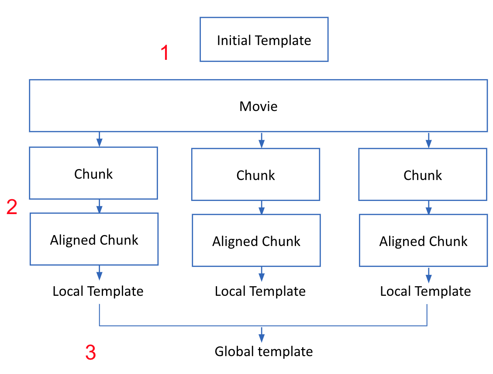
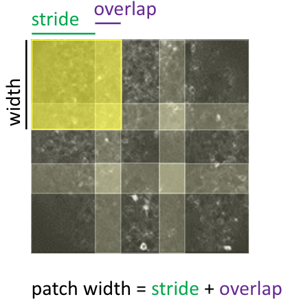
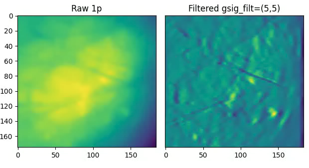

.. Algo

Algorithm Overview
==================

Jnormcorre implements the template-based motion correction algorithm from
normcorre, illustrated by the following diagram:

1. **Estimate a template for the video.**
    Start with an "initial template" of the data;
    we align frames of the movie to this template. If no template is provided, an initial template is estimated
    from the first few frames of the movie.
2. **Align various frames to this template.**
    a. Partition the frames of the movie into "chunks".
    b. Align all frames in each chunk to the initial template. Use either rigid or piecewise rigid registration (see below).
    c. For each chunk, take these aligned results and estimate a new "local" template.
3. **Update the template from step 1.**
    Combine the estimated local templates from step 2 by taking the "median" for each pixel
    to get an updated global template.

Steps 1 - 3 are repeated iteratively across the frames of the movie.
In the end-to-end pipeline (using the jnormcorre.motion_correction.MotionCorrect object) we do steps 1 - 3 a few times with rigid motion correction
and then afterwards with piecewise rigid motion correction.

Motion Correction Methods
=========================

To align a frame to a given template, there are two related approaches we use:

1. **Rigid Motion Correction**: This finds how many units up/down and left/right can we shift any image to best
    match the template? Note: this is computed with subpixel precision.
2. **Piecewise Rigid Correction**: This breaks the frame (and template) into many overlapping square patches,
    does a rigid motion correction on the patches, and stitches the results back together via interpolation;
    see below for an illustration of how the FOV is partitioned for this approach.

1p Processing
=============
Some modalities like 1-photon imaging have significant background (neuropil) contamination.
The spatially smooth background overpowers the signals, and this negatively affects both the
template and the quality of the registration.

To address this, we follow the modified pipeline when
we try to align a frame to a template

(1) Spatially high-pass filter the template
(2) Spatially high-pass filter the frame
(3) Estimate the optimal shifts between 1 and 2.
(4) Apply the shifts to the "unfiltered" frames to register the data.

The high-pass filter kernel is a mean-subtracted 2D Gaussian
specified by the gSig_filt parameter; see API for more details.

Steps (1) and (2) enhance the salient parts of the image (blood vessels, cells) while
suppressing the background (see below figure).

Supported Data Formats
======================
This repo supports 2D imaging videos (Frames, X, Y).
Any data loader which implements the simple "lazy_array" interface; see (jnormcorre.utils.lazy_array).
works here. This is really a basic array-like interface, so numpy arrays, etc. are automatically
compatible. Tiff and HDF5 files are also currently supported; see (jnormcorre.utils.registrationarrays).